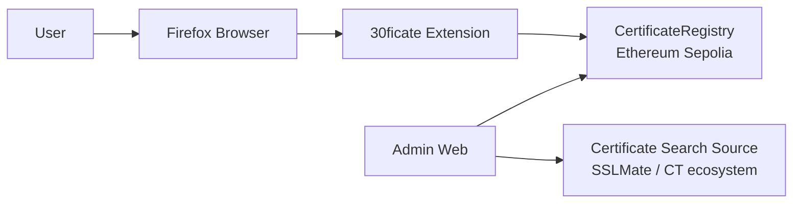
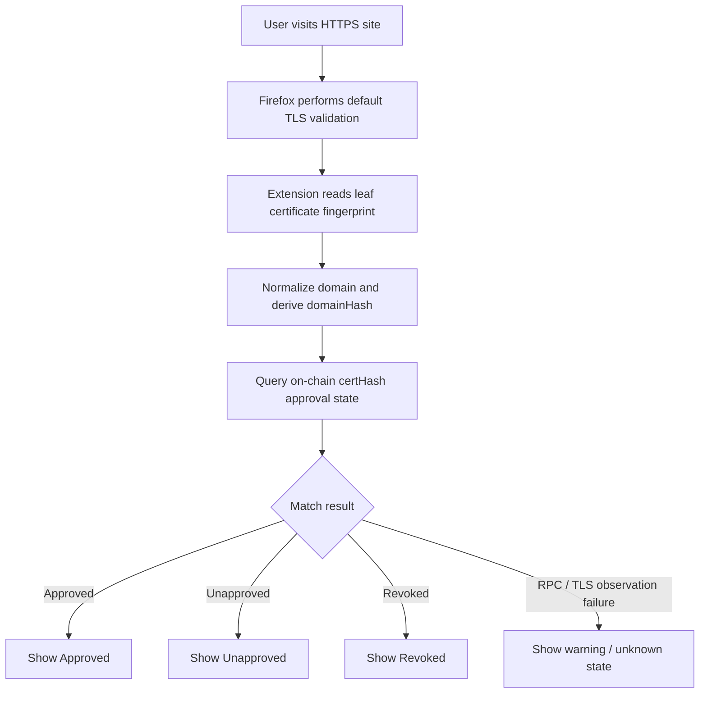

# 30ficate

Firefox 기반 온체인 TLS 인증서 검증 보조 시스템

---

# 🇰🇷 Korean

## 프로젝트 개요

30ficate는 Firefox 기반 온체인 TLS 인증서 검증 보조 시스템입니다.

브라우저가 실제 TLS 연결에서 받은 인증서 fingerprint를 기반으로, 도메인 owner가 온체인에 승인한 인증서인지 추가 검증합니다.

즉, 30ficate Firefox Extension은 현재 접속한 사이트의 HTTPS 인증서가 도메인 관리자(owner)에게 온체인 승인되었는지를 확인하는 브라우저 보조 보안 레이어입니다.

브라우저 확장은 현재 탭의 leaf certificate fingerprint를 읽고, on-chain certificate registry와 비교하여 승인 여부를 경고 UI로 표시합니다.

또한 Certificate Transparency(CT) 생태계 기반 인증서 검색 소스를 조회하여 특정 도메인에 발급된 인증서를 발견하고, owner가 해당 인증서를 승인 또는 검토할 수 있는 기능을 제공합니다.

기존 PKI를 대체하지 않고, CA 오발급 및 승인되지 않은 인증서 사용을 탐지하기 위한 보안 보조 레이어를 제공합니다.

---

## 프로젝트 동기

기존 웹 PKI는 다음 구조를 사용합니다.

```text
CA가 인증서를 발급
→ 브라우저가 신뢰
```

하지만 다음과 같은 문제가 발생할 수 있습니다.

- CA 오발급
- DNS 일시 탈취 후 인증서 발급
- 폐기 지연
- 도메인 owner가 승인하지 않은 인증서 사용

30ficate는 다음 구조를 추가합니다.

```text
CA가 인증서를 발급
+ CT 로그에 인증서 기록
+ 도메인 owner가 certHash를 온체인 승인
→ Firefox Extension이 추가 검증
```

즉, CA가 발급했더라도 도메인 owner가 승인하지 않은 인증서는 위험 신호로 표시합니다.

---

## 핵심 기능

- Firefox TLS certificate inspection
- SHA-256 certificate fingerprint verification
- On-chain approved certificate registry
- Revoked certificate detection
- Certificate Transparency 기반 certificate discovery
- Browser warning UI
- Smart contract auditability
- Domain owner approval workflow

---

## 시스템 구조

```text
Firefox Browser
 └─ 30ficate Extension
      ├─ TLS certificate fingerprint extraction
      ├─ On-chain certificate verification
      └─ Warning UI

Admin Web
 ├─ Domain registration
 ├─ CT certificate discovery
 ├─ Certificate approval
 └─ Certificate revocation

Ethereum Sepolia
 └─ CertificateRegistry Smart Contract
```

---

## 시스템 구조 다이어그램



---

## 인증서 검증 흐름

```text
1. 사용자가 HTTPS 사이트 접속
2. Firefox가 기본 TLS 검증 수행
3. 30ficate가 TLS certificate fingerprint 추출
4. 온체인 approved certHash 조회
5. 현재 certHash와 approved certHash 비교
6. 결과 UI 표시
```

---

## 인증서 검증 흐름 다이어그램



---

## CT 검색 연동

30ficate는 CT 검색 API를 사용하여 등록된 도메인과 관련된 인증서를 발견합니다.

```text
1. 도메인 owner가 도메인 등록
2. Admin Web이 인증서 검색 API 조회
3. 검색 결과에서 owner가 승인할 인증서를 선택
4. 선택한 인증서를 approve 흐름으로 연결
5. approve 시 온체인 등록
```

현재 구현은 검색 결과를 approval flow에 연결하는 구조이며, 실시간 자동 모니터링은 future work로 남겨두었습니다.

---

## 위협 모델

### 방어 대상

- CA 오발급
- 승인되지 않은 인증서 발급
- DNS 탈취 기반 인증서 발급
- 폐기된 인증서 재사용
- 도메인 owner가 승인하지 않은 인증서

### 방어하지 못하는 대상

- 피싱 도메인
- 서버 자체 해킹
- 사용자 단말 악성코드
- Root CA 저장소 오염
- TLS가 없는 HTTP 연결

---

## 왜 블록체인을 사용하는가

30ficate는 다음 이유로 블록체인을 사용합니다.

- 인증서 승인/폐기 기록 위변조 방지
- 공개 감사 가능성
- 탈중앙 검증
- append-only 성격 제공
- 도메인 owner 승인 이력 공개 검증 가능

---

## 왜 Firefox인가

30ficate MVP가 Firefox를 우선 대상으로 삼는 가장 큰 이유는, 브라우저 확장 레벨에서 TLS 연결에 대한 certificate security info를 읽을 수 있는 API를 제공하기 때문입니다.

구체적으로 Firefox WebExtension은 `browser.webRequest.getSecurityInfo()`를 통해:

- requestId 기반 HTTPS 요청의 보안 상태 조회
- certificate chain 접근
- leaf certificate 식별 정보 확보

를 가능하게 합니다.

30ficate는 이 API를 이용해 현재 탭이 실제로 받은 leaf certificate를 관찰하고, 그 fingerprint를 on-chain approval registry와 비교합니다.

즉 Firefox를 선택한 이유는 단순한 브라우저 선호가 아니라, **브라우저 확장만으로 TLS 연결 시점의 인증서 정보를 읽어 보안 검증 레이어를 얹을 수 있는 현실적인 API를 제공하기 때문**입니다.

---

## 현재 한계

- TLS 연결 전 차단 불가
- Firefox-only MVP
- 자동 DNS ownership verification 미구현
- RPC availability 의존
- 인증서 검색은 외부 CT 검색 API 의존
- CertStream 기반 실시간 자동 모니터링 미구현

30ficate는 브라우저 TLS 검증을 대체하는 시스템이 아니라, 사후 검증 및 경고 레이어입니다.

---

## 향후 확장 방향

- DNS TXT ownership verification
- Chromium support
- Local proxy pre-connection verification
- Multi-owner approval
- Hardware wallet signing
- CertStream 기반 real-time certificate monitoring
- Slack/Discord certificate alerts
- SIEM integration
- Auto certificate discovery worker
- Local node/light client support

---

## 주요 확장 목표 — DNS TXT 기반 도메인 owner 인증

현재 MVP에서는 domain registration이 지갑 주소 기반 수동 등록입니다. 즉, 사용자가 특정 domain과 owner address를 입력하고 `registerDomain()`을 호출하면 온체인에 owner가 기록됩니다.

이 방식은 MVP로서는 충분하지만, 장기적으로는 **실제 도메인 제어권을 가진 주체가 맞는지**를 DNS 레벨에서 검증하는 절차가 필요합니다.

30ficate의 주요 확장 목표는 이를 DNS TXT record 기반 owner verification으로 보강하는 것입니다.

예상 흐름은 다음과 같습니다.

```text
1. 사용자가 admin web에서 도메인 등록 시작
2. 시스템이 해당 도메인에 대해 검증용 challenge 문자열 생성
3. owner가 DNS TXT record에 challenge 게시
4. 검증 모듈이 authoritative DNS 조회로 TXT record 확인
5. challenge가 일치하면 owner verification 성공
6. 그 이후에만 registerDomain() 또는 owner binding 허용
```

이 구조를 도입하면 다음 이점이 생깁니다.

- 단순 지갑 주소 입력만으로 도메인 owner를 주장하는 문제 완화
- 실제 DNS 제어권을 가진 운영자와 on-chain owner binding 강화
- 승인 주체의 신뢰성 향상
- 향후 multi-owner approval, 자동 discovery worker와 자연스럽게 연결 가능

검증용 TXT record는 예를 들면 다음과 같은 형태가 될 수 있습니다.

```text
_30ficate.example.com TXT "30ficate-verification=<challenge>"
```

또는 root/apex domain에 직접:

```text
example.com TXT "30ficate-verification=<challenge>"
```

를 두는 방식도 가능합니다.

추후 구현 시 고려할 점은 다음과 같습니다.

- TXT record를 어느 label에 둘 것인지
- challenge의 만료 시간과 재사용 방지
- authoritative DNS 기준으로 조회할지, resolver cache를 어떻게 다룰지
- wildcard / subdomain owner policy를 어떻게 정의할지
- owner transfer나 owner re-verification을 어떤 정책으로 처리할지

즉 DNS TXT verification은 단순한 편의 기능이 아니라, **도메인 제어권과 온체인 approval authority를 연결하는 핵심 확장 포인트**입니다.

---

## 연구 목표

30ficate는 기존 Web PKI 생태계를 대체하지 않고, 도메인 owner의 온체인 인증서 승인 모델이 기존 TLS 신뢰 모델을 얼마나 강화할 수 있는지 탐구하는 연구 프로젝트입니다.

---

# 🇺🇸 English

## Overview

30ficate is a Firefox-based on-chain TLS certificate verification support system.

It performs additional verification by checking whether the certificate fingerprint actually received during a TLS connection has been approved on-chain by the domain owner.

In other words, the 30ficate Firefox Extension acts as a browser-side security layer that checks whether the HTTPS certificate of the currently visited site has been approved on-chain by the domain administrator (owner).

The extension reads the leaf certificate fingerprint of the current tab and compares it against the on-chain certificate registry, then displays the approval result through a warning UI.

It also queries CT ecosystem-based certificate search sources to discover certificates issued for a specific domain and lets the owner approve or review them.

30ficate does not replace the existing PKI model. Instead, it provides a security support layer that helps detect CA mis-issuance and unauthorized certificate use.

---

## Motivation

Traditional Web PKI follows the structure below:

```text
CA issues certificate
→ Browser trusts it
```

However, the following problems can still occur:

- CA mis-issuance
- Certificate issuance after temporary DNS hijacking
- Delayed revocation response
- Use of certificates not approved by the domain owner

30ficate adds the following layer:

```text
CA issues certificate
+ Certificate is recorded in CT logs
+ Domain owner approves certHash on-chain
→ Firefox Extension performs additional verification
```

In other words, even if a CA issued the certificate, 30ficate treats it as a risk signal if the domain owner did not approve it.

---

## Core Features

- Firefox TLS certificate inspection
- SHA-256 certificate fingerprint verification
- On-chain approved certificate registry
- Revoked certificate detection
- Certificate Transparency-based certificate discovery
- Browser warning UI
- Smart contract auditability
- Domain owner approval workflow

---

## System Architecture

```text
Firefox Browser
 └─ 30ficate Extension
      ├─ TLS certificate fingerprint extraction
      ├─ On-chain certificate verification
      └─ Warning UI

Admin Web
 ├─ Domain registration
 ├─ CT certificate discovery
 ├─ Certificate approval
 └─ Certificate revocation

Ethereum Sepolia
 └─ CertificateRegistry Smart Contract
```

---

## System Architecture Diagram


---

## Certificate Verification Flow

```text
1. User visits an HTTPS site
2. Firefox performs its normal TLS validation
3. 30ficate extracts the TLS certificate fingerprint
4. The extension reads the approved certHash from the chain
5. It compares the current certHash with the approved certHash
6. The result is shown in the UI
```

---

## Certificate Verification Flow Diagram


---

## CT Search Integration

30ficate uses CT search APIs to discover certificates related to registered domains.

```text
1. Domain owner registers a domain
2. Admin Web queries a certificate search API
3. The owner selects a certificate from the search results
4. The selected certificate is passed into the approve flow
5. On approval, it is registered on-chain
```

The current implementation connects search results directly into the approval flow. Real-time automated monitoring is still left as future work.

---

## Threat Model

### Defended Against

- CA mis-issuance
- Unauthorized certificate issuance
- Certificate issuance after DNS hijacking
- Reuse of revoked certificates
- Certificates not approved by the domain owner

### Not Defended Against

- Phishing domains
- Server-side compromise
- Malware on the user device
- Root CA store compromise
- Plain HTTP without TLS

---

## Why Use Blockchain

30ficate uses blockchain for the following reasons:

- Tamper-resistant certificate approval and revocation records
- Public auditability
- Decentralized verification
- Append-only characteristics
- Publicly verifiable domain owner approval history

---

## Why Firefox

The biggest reason 30ficate MVP targets Firefox first is that it provides an API that allows a browser extension to read certificate security info from TLS connections.

Specifically, Firefox WebExtensions provide `browser.webRequest.getSecurityInfo()`, which makes the following possible:

- Reading the security state of an HTTPS request using requestId
- Accessing the certificate chain
- Obtaining leaf certificate identification data

30ficate uses this API to observe the leaf certificate actually received by the current tab and compare its fingerprint with the on-chain approval registry.

In short, Firefox was chosen not because of simple browser preference, but because it offers a realistic API that lets a browser extension read certificate information at TLS connection time and layer additional security verification on top.

---

## Current Limitations

- Cannot block before the TLS connection is established
- Firefox-only MVP
- Automatic DNS ownership verification is not yet implemented
- Depends on RPC availability
- Certificate discovery currently depends on external CT search APIs
- CertStream-based real-time automatic monitoring is not implemented yet

30ficate is not a replacement for the browser’s TLS validation. It is a post-validation warning and verification layer.

---

## Future Work

- DNS TXT ownership verification
- Chromium support
- Local proxy-based pre-connection verification
- Multi-owner approval
- Hardware wallet signing
- CertStream-based real-time certificate monitoring
- Slack/Discord certificate alerts
- SIEM integration
- Auto certificate discovery worker
- Local node/light client support

---

## Key Expansion Goal — DNS TXT-Based Domain Owner Verification

In the current MVP, domain registration is a manual wallet-address-based process. In other words, a user enters a domain and an owner address, then calls `registerDomain()`, and the owner is recorded on-chain.

That is sufficient for an MVP, but long-term the system needs a way to verify whether the registrant actually controls the domain at the DNS level.

One of 30ficate’s major expansion goals is to strengthen this with DNS TXT record-based owner verification.

The expected flow is as follows:

```text
1. User starts domain registration in the admin web
2. The system generates a verification challenge for the domain
3. The owner publishes the challenge in a DNS TXT record
4. A verification module checks the TXT record through authoritative DNS lookup
5. If the challenge matches, owner verification succeeds
6. Only then is registerDomain() or owner binding allowed
```

This approach provides the following benefits:

- Reduces the risk of claiming domain ownership through wallet input alone
- Strengthens the binding between actual DNS control and on-chain owner authority
- Improves trust in the approval authority
- Naturally connects to future multi-owner approval and automated discovery workers

An example verification TXT record could look like this:

```text
_30ficate.example.com TXT "30ficate-verification=<challenge>"
```

Or directly on the root/apex domain:

```text
example.com TXT "30ficate-verification=<challenge>"
```

That future implementation will need to address several design questions:

- Which DNS label should hold the TXT record
- Challenge expiration and replay prevention
- Whether verification should rely on authoritative DNS lookups
- How resolver cache behavior should be handled
- How wildcard and subdomain owner policy should be defined
- How owner transfer or re-verification should be handled

In other words, DNS TXT verification is not just a convenience feature. It is a core expansion point that connects domain control to on-chain approval authority.

---

## Research Goal

30ficate is a research project that does not attempt to replace the existing Web PKI ecosystem, but instead explores how much an on-chain domain-owner certificate approval model can strengthen the existing TLS trust model.

---

## Current Limitations

- Does not block TLS connections before handshake
- Firefox-only MVP
- No automatic DNS ownership verification
- Depends on RPC availability
- CT discovery relies on external CT APIs

30ficate is designed as a post-verification warning layer, not a replacement for browser TLS validation.

---

## Future Work

- DNS TXT ownership verification
- Chromium support
- Local proxy pre-connection verification
- Multi-owner approval
- Hardware wallet signing
- Certificate monitoring dashboard
- Slack/Discord certificate alerts
- SIEM integration
- Auto certificate discovery worker
- Local node/light client support

---

## Research Goal

30ficate explores whether domain-owner-controlled on-chain certificate approval can strengthen trust in the existing Web PKI ecosystem without replacing browsers’ native TLS validation systems
