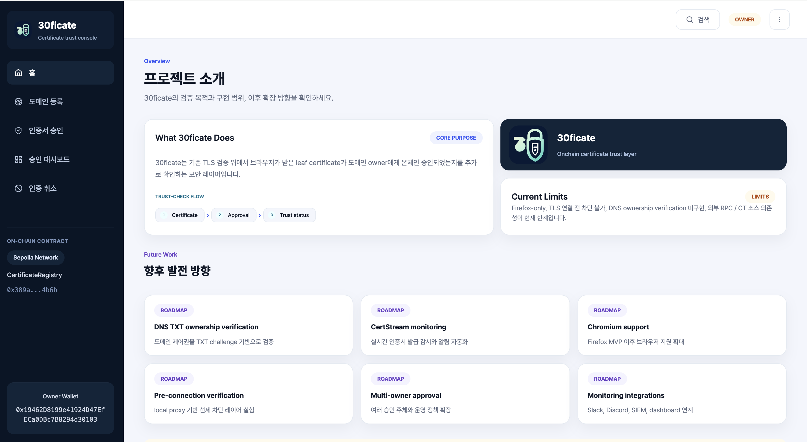
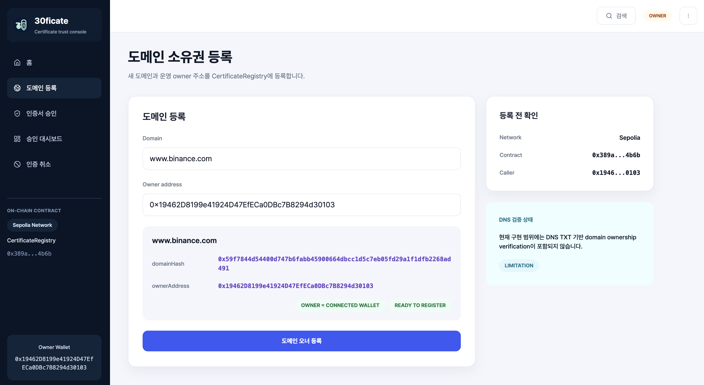
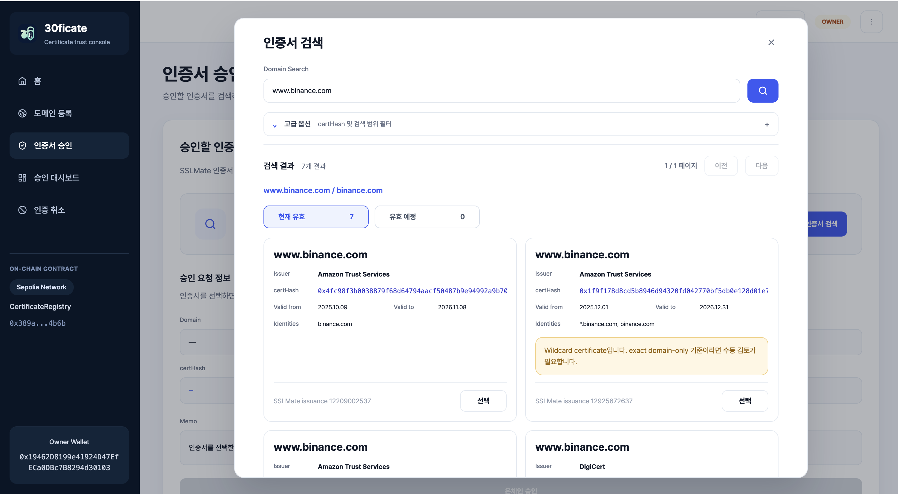
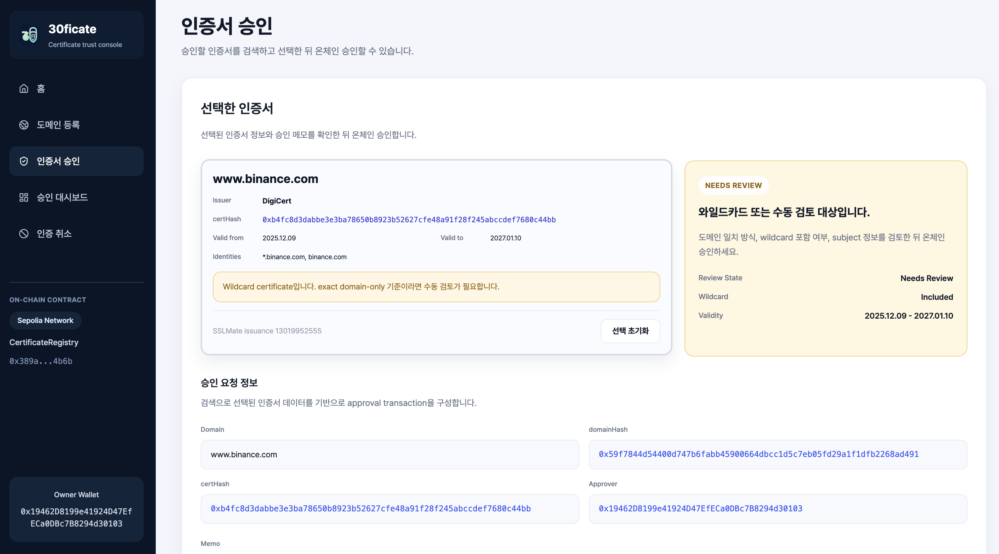
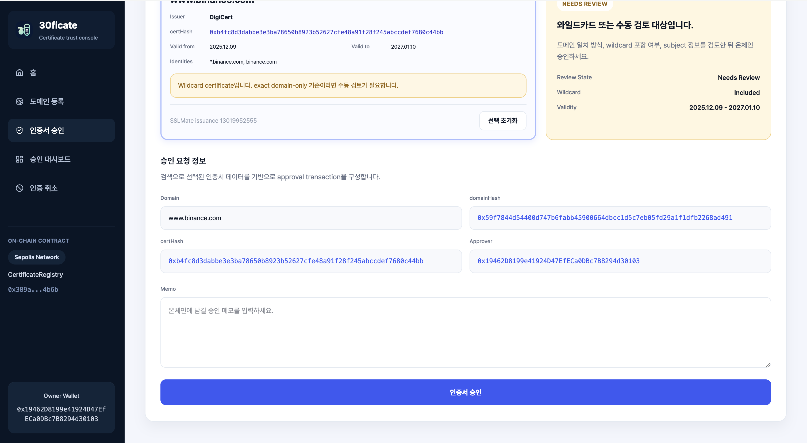
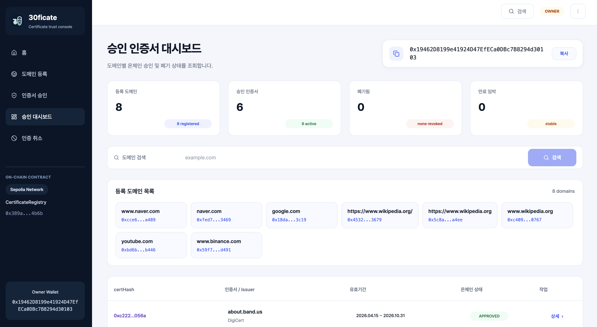
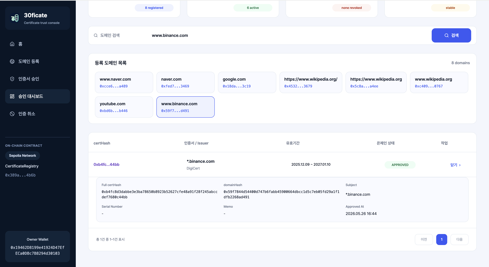
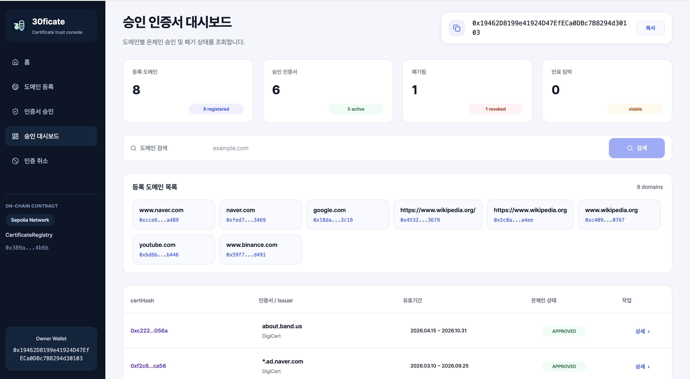
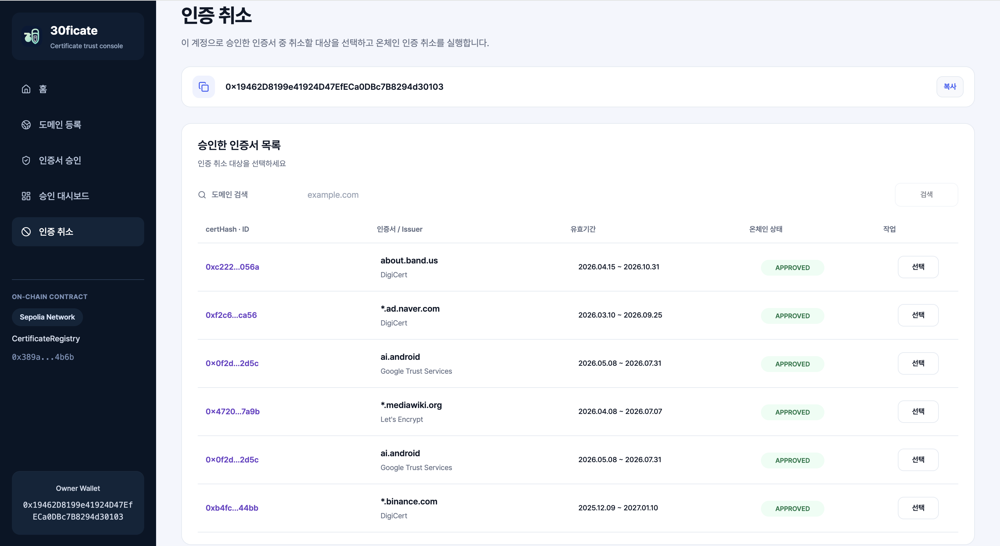
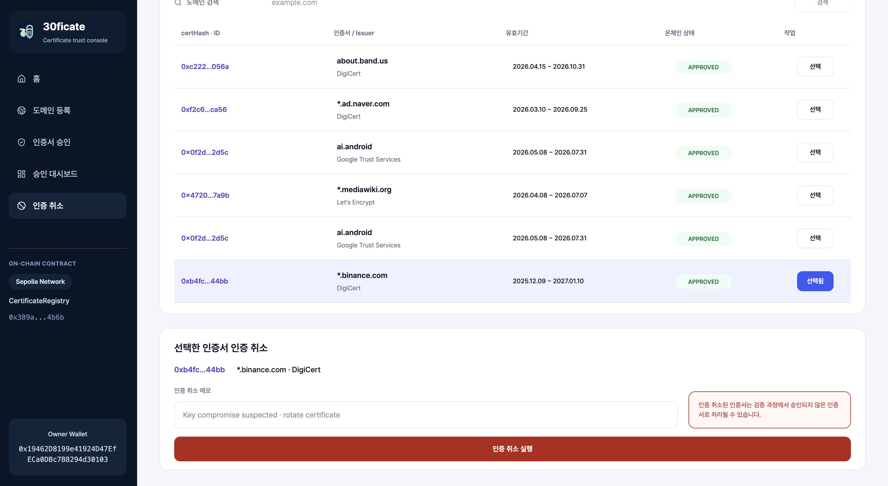

# Admin Web

`admin-web`은 30ficate의 관리자 콘솔입니다.

도메인 owner가 지갑을 연결하고, 도메인을 등록하고, 인증서를 검색해서 온체인 승인하고, 이미 승인된 인증서를 조회하거나 폐기하는 흐름을 한 곳에서 처리합니다.

## 역할

이 모듈은 다음 역할을 담당합니다.

- 지갑 연결
- 도메인 등록
- 인증서 검색 및 승인
- 승인된 인증서 대시보드 조회
- 인증서 폐기

즉 일반 사용자용 화면이 아니라, **도메인 관리자(owner/operator)가 on-chain certificate registry를 운영하는 관리자 웹**입니다.

## 현재 구현 범위

현재 `admin-web`에는 다음이 구현되어 있습니다.

### 홈

- 프로젝트 소개
- 향후 발전 방향
- RainbowKit 기반 지갑 연결 모듈
- 로그인하지 않으면 홈 외 탭 접근 차단

### 도메인 등록

- domain 입력
- owner address 지정
- `registerDomain()` 호출

### 인증서 승인

- SSLMate Certificate Search API 기반 인증서 검색
- 검색 결과 카드 검토
- 선택한 인증서를 approval flow로 연결
- `approveCertificate()` 호출

### 승인 인증서 대시보드

- 도메인 기준 `getApprovedCertificates()` 조회
- 각 `certHash`의 승인/폐기 상태 확인

### 폐기

- 도메인 검색
- on-chain owner 확인
- 승인된 인증서 목록에서 폐기 대상 선택
- owner 지갑과 일치할 때만 `revokeCertificate()` 활성화

## UX 화면 가이드

### 홈

관리 콘솔의 목적과 현재 범위를 먼저 보여주고, 좌측 메뉴와 지갑 모듈을 통해 운영 흐름으로 진입합니다.



### 도메인 등록

owner가 등록할 도메인과 owner address를 입력하고, 온체인 등록 가능 여부를 확인한 뒤 `registerDomain()`을 실행합니다.



### 인증서 승인

승인 화면은 `검색 전 → 검색 결과 검토 → 선택 후 승인` 흐름으로 이어집니다. 검색 결과는 SSLMate 기반으로 불러오고, 선택된 인증서 메타데이터를 그대로 승인 트랜잭션에 연결합니다.





### 승인 인증서 대시보드

등록된 도메인 기준으로 승인 인증서 목록과 온체인 상태를 한 곳에서 조회합니다. 상단 카드에서는 등록 도메인 수, 승인 인증서 수, 폐기 수, 만료 임박 건수를 요약합니다.




인증 취소 이후에는 폐기 상태가 대시보드에 다시 반영됩니다.



### 인증 취소

인증 취소 화면에서는 승인된 인증서 목록에서 대상을 선택하고, 메모를 남긴 뒤 `revokeCertificate()`를 실행합니다.




## 인증서 검색 흐름

현재 인증서 검색은 `SSLMate Certificate Search API`를 사용합니다.

흐름은 다음과 같습니다.

```text
1. owner가 검색 모달에서 domain 입력
2. admin-web이 SSLMate에서 관련 인증서 검색
3. 현재 유효 / 곧 유효 기준으로 결과 정리
4. owner가 인증서 카드 선택
5. 선택한 인증서 메타데이터와 certHash를 approval flow에 주입
6. owner가 온체인 승인 실행
```

현재 구현은 검색 결과를 approval flow에 연결하는 구조이며, 실시간 CT monitoring은 포함하지 않습니다.

## on-chain 연동

`admin-web`은 `CertificateRegistry`와 연동합니다.

주요 write function:

- `registerDomain()`
- `approveCertificate()`
- `revokeCertificate()`

주요 read function:

- `getDomainOwner()`
- `getApprovedCertificates()`
- `getCertificateStatus()`

## 환경 변수

현재 필요한 대표 환경값은 다음입니다.

- `VITE_WALLETCONNECT_PROJECT_ID`


## 현재 한계

- DNS TXT 기반 domain ownership verification은 아직 없음
- 검색 결과는 외부 certificate search API에 의존
- 실시간 monitoring은 아직 없음
- admin-web은 approval/operations console이며, 브라우저 runtime verification은 extension이 담당

## 관련 모듈

- 계약 인터페이스와 배포 정보는 `contracts/`를 기준으로 참조
- 실제 브라우저 인증서 검증은 `extension/`에서 수행
