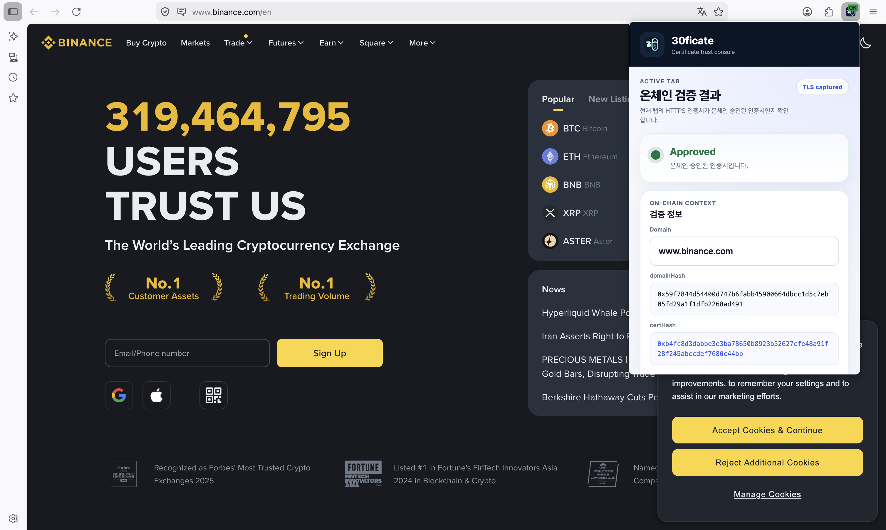
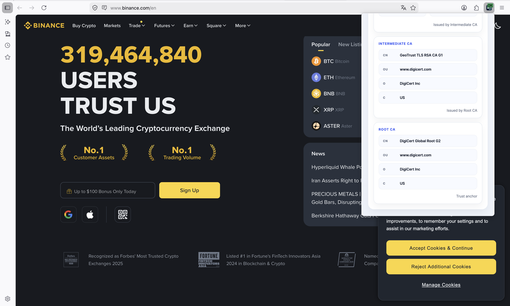
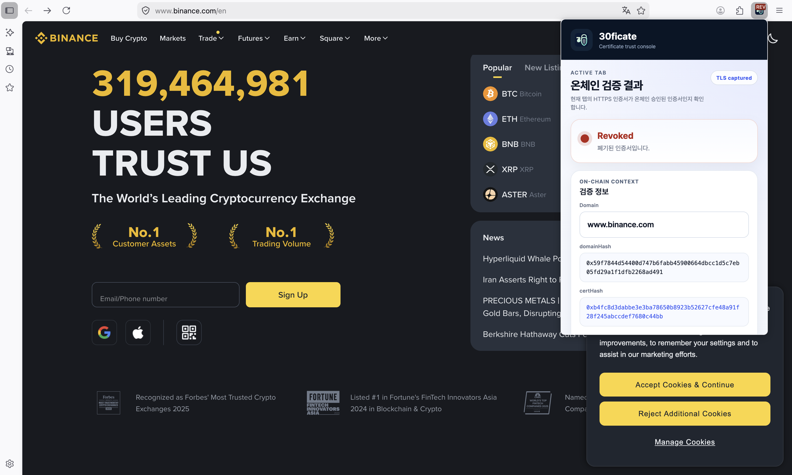

# Extension

`extension`은 30ficate의 브라우저 인증서 검증 레이어입니다.

이 모듈은 Firefox WebExtension으로 동작하며, 현재 탭이 실제로 받은 HTTPS leaf certificate를 관찰한 뒤 그 fingerprint가 도메인 owner에 의해 온체인 승인되었는지를 확인합니다.

## 역할

이 모듈은 다음 역할을 담당합니다.

- HTTPS 요청 관찰
- leaf certificate fingerprint 추출
- normalized domain → domainHash 계산
- on-chain certificate approval 상태 조회
- popup / badge 경고 UI 표시

즉 기존 브라우저 TLS 검증을 대체하는 것이 아니라, **브라우저가 이미 받아들인 인증서에 대해 domain owner approval 여부를 추가로 검증하는 보조 레이어**입니다.

## 현재 구현 범위

현재 `extension`에는 다음이 구현되어 있습니다.

- Firefox `browser.webRequest.getSecurityInfo()` 기반 인증서 관찰
- certificate chain 접근 및 leaf certificate 추출
- SHA-256 기반 certificate fingerprint 비교
- Ethereum Sepolia `CertificateRegistry` 조회
- popup에 `domainHash` / `certHash` 표시
- popup 상태 UI
- badge 상태 UI
- same-origin cached state 기반 SPA fallback
- apex / `www` 후보 fallback 조회
- `esbuild` 기반 번들링

## UX 화면 가이드

### 기본 popup 흐름

popup은 현재 탭에서 실제로 관찰한 leaf certificate를 기준으로 온체인 승인 여부를 보여줍니다. 상단에는 검증 결과와 TLS 관찰 여부를, 중간에는 domain / hash 정보를, 하단에는 certificate chain을 보여줍니다.



### 검증 정보와 체인 메타데이터

검증 정보 카드에서는 현재 탭의 domain, domainHash, certHash를 확인할 수 있고, certificate chain 카드에서는 leaf / intermediate / root를 구분해서 보여줍니다.


### 체인 기반 증거 확인

leaf certificate의 발급 날짜와 만료 날짜, 그리고 각 subject DN 메타데이터를 함께 확인할 수 있어, 어떤 실제 인증서를 기준으로 온체인 검증했는지 빠르게 파악할 수 있습니다.



### 폐기 이후 상태 반영

인증서가 admin-web에서 폐기되면 popup도 이후 조회 시 revoked 계열 상태와 경고 UI로 반영됩니다.



## 검증 흐름

```text
1. 사용자가 HTTPS 사이트 접속
2. Firefox가 기본 TLS 검증 수행
3. extension이 requestId 기준 security info 조회
4. leaf certificate fingerprint 추출
5. normalizedDomain → domainHash 계산
6. on-chain certHash approval 상태 조회
7. popup / badge에 결과 표시
```

## Apex / WWW Fallback

기본적으로 extension은 현재 요청 hostname 그대로 `domainHash`를 만들어 먼저 조회합니다.

다만 운영 환경에서는 같은 인증서를 두고도 admin이 `naver.com`으로만 등록했는데, 실제 접속은 `www.naver.com`으로 끝나는 경우가 있습니다.

현재 extension은 이런 경우를 줄이기 위해 hostname 기준 exact 조회를 먼저 수행한 뒤, apex / `www` 후보를 순서대로 추가 조회합니다.

예:

```text
현재 접속 hostname: www.naver.com
현재 TLS leaf certificate: 1개
현재 certificate certHash: 1개

조회 순서:
1. domainHash(www.naver.com) + certHash
2. domainHash(naver.com) + certHash
```

반대로 `naver.com`으로 접속한 경우에는:

```text
1. domainHash(naver.com) + certHash
2. domainHash(www.naver.com) + certHash
```

즉 extension이 여러 인증서를 읽는 것은 아니고, **실제로 받은 leaf certificate는 하나만 유지한 채 같은 `certHash`를 domain 후보와 순차 대조**하는 구조입니다.

## 상태 분류

현재 extension은 다음 상태를 사용합니다.

- `Approved`
  - 현재 certificate fingerprint가 온체인 승인 목록에 존재함
- `Unapproved`
  - 현재 certificate fingerprint가 승인 목록에 없음
- `Revoked`
  - 현재 certificate fingerprint가 폐기 상태로 기록됨
- `HTTP`
  - HTTPS 인증서 검증 대상이 아님
- `TLSObservationFailure`
  - 현재 요청에서 certificate security info를 읽지 못함
- `RPCFailure`
  - 인증서는 읽었지만 on-chain 조회가 실패함
- `Unknown`
  - 아직 검증 결과가 없음

## Firefox를 사용하는 이유

현재 MVP가 Firefox를 대상으로 하는 이유는 `browser.webRequest.getSecurityInfo()`를 통해 브라우저 확장 레벨에서 TLS 요청의 certificate security info를 읽을 수 있기 때문입니다.

이 API를 통해:

- requestId 기준 보안 상태 조회
- certificate chain 접근
- leaf certificate 식별

이 가능해집니다.

## SPA 대응

SPA 사이트에서는 전통적인 full navigation이 자주 발생하지 않기 때문에, 단순히 `main_frame` 요청만 보고 있으면 `Unknown` 상태가 길게 유지될 수 있습니다.

이를 줄이기 위해 현재 extension은:

- `main_frame` 요청에서 실제 TLS seed 관찰
- 같은 origin에 대한 최근 검증 결과 캐시
- navigation 시 cached state 재적용

전략을 사용합니다.

즉 새 TLS 관찰 기회가 없는 SPA 이동에서도, 같은 origin이라면 최근 관찰된 인증서 상태를 재사용해 UX를 안정화합니다.

## 현재 한계

- Firefox-only MVP
- requestId 없이 현재 탭의 인증서를 직접 다시 읽는 API는 없음
- 브라우저 내부 TLS 연결 상태를 완전히 네이티브하게 추적하지는 못함
- pre-connection blocking은 없음
- RPC availability에 의존

즉 extension은 브라우저 TLS 스택 자체를 통제하는 것이 아니라, **Firefox가 노출해주는 WebExtension API 범위 안에서 현재 인증서 상태를 관찰하고 비교하는 구조**입니다.

## 빌드

주요 명령:

- `pnpm install`
- `pnpm build`

Firefox에 임시 로드할 때는 `manifest.json` 기준으로 `about:debugging`에서 불러오면 됩니다.

## 관련 모듈

- on-chain registry 기준은 `contracts/`
- owner 승인 및 폐기 운영 UI는 `admin-web/`
